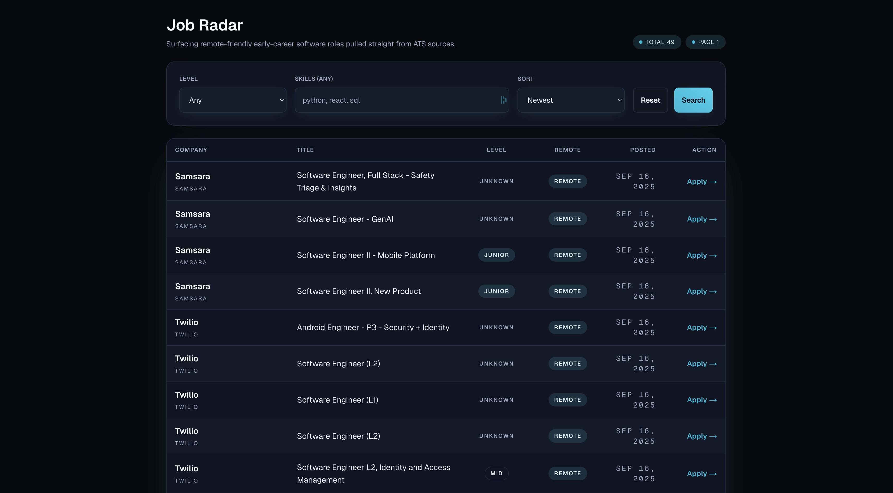
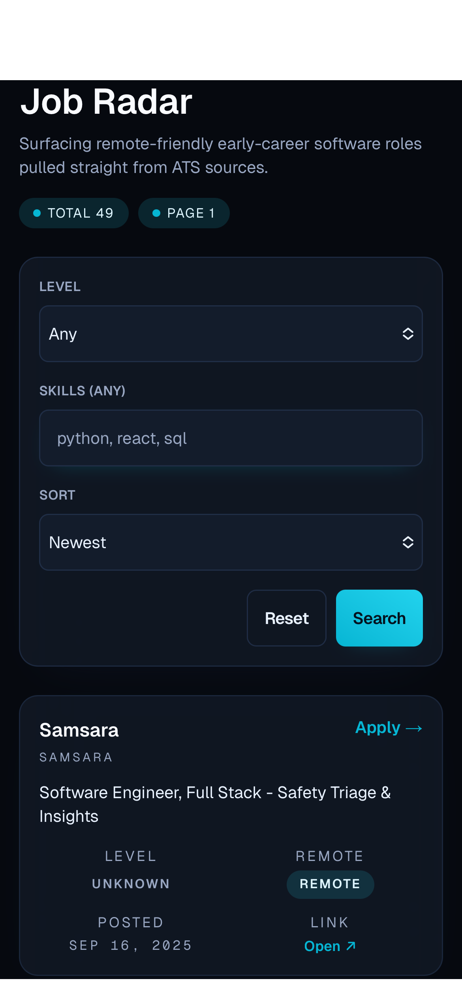

# Job Radar

Tracks remote-friendly, early-career software roles by crawling ATS providers, applying junior filters, and exposing the results through a FastAPI backend, Python CLI, and Next.js dashboard.

## Live Demo

- UI (Vercel): **PLACEHOLDER_UI_URL**
- API (Render): **PLACEHOLDER_API_URL**
- Public mode: read-only UI backed by the public API; ingest/admin routes stay gated behind the admin token.

## Supported Providers

- ✅ **Greenhouse** – production-ready connector and default source.
- 🧪 **Ashby, Lever, Workday, Workable** – experimental connectors disabled by default; enable privately with `ENABLE_EXPERIMENTAL=true` while testing.

## Data Quality

- **Entry-level exclusion**: `FILTER_ENTRY_EXCLUSIONS` applies title keywords plus ≥3-year experience checks shared between ingestion and the API.
- **Dates**: `GITHUB_CURATED_DATE_SCRAPE` captures explicit posted dates from curated sources; `GITHUB_DATE_INFERENCE` infers missing dates from git history.
- **Undated jobs**: clients can opt back in via `include_undated=true` when calling `GET /jobs`.

## Known Limitations

- Non-Greenhouse connectors still require polishing and verified credentials before public launch.
- Curated feeds may return undated roles when the upstream list does not expose a stable posted-at field.

## Getting Started (Local)

1. **Backend & CLI**

   ```bash
   python3 -m venv .venv
   source .venv/bin/activate
   pip install -r requirements.txt
   uvicorn radar.api.main:app --reload
   ```

2. **Web UI**

   ```bash
   cd job-radar-ui
   npm install
   NEXT_PUBLIC_API_BASE_URL=http://localhost:8000 PUBLIC_READONLY=false npm run dev
   ```

3. **Optional Docker** – Use when you need a local PostgreSQL instance or to mirror deployment infrastructure:

   ```bash
   docker run --name radar-postgres -e POSTGRES_USER=radar -e POSTGRES_PASSWORD=radar \
     -e POSTGRES_DB=radar -p 5432:5432 -d postgres:16
   ```

   (Skip Docker for day-to-day CLI/API iteration; SQLite works out of the box.)

## Security

- Set `PUBLIC_READONLY=true` to hide client write controls and block browser-side mutating calls.
- Admin endpoints (`/ingest/curated`, `/scan/ats`, `/admin/backfill-posted-at`, `/metrics/ingestion` when `METRICS_PUBLIC=false`) require an `x-token` header that matches `RADAR_ADMIN_TOKEN`.

## Quick API Reference

- `GET /jobs` – query params: `limit`, `offset`, `provider`, `order`, `include_undated`; respects junior filters and provider gating.
- `POST /ingest/curated` – triggers curated GitHub import (admin only; `x-token`).
- `POST /admin/backfill-posted-at` – fills missing GitHub posted dates (admin only; `x-token`).
- `GET /metrics/ingestion` – live ingestion metrics; public only when `METRICS_PUBLIC=true`.

## Env Summary

| Scope    | Variable                      | Purpose                                                         |
| -------- | ----------------------------- | --------------------------------------------------------------- |
| Backend  | `DATABASE_URL`                | SQLAlchemy connection string (PostgreSQL recommended).          |
| Backend  | `RADAR_ADMIN_TOKEN`           | Shared secret for admin-only endpoints.                         |
| Backend  | `FILTER_ENTRY_EXCLUSIONS`     | Enables entry-level filtering heuristics.                       |
| Backend  | `GITHUB_CURATED_DATE_SCRAPE`  | Persist scraped posted-at timestamps from curated feeds.        |
| Backend  | `GITHUB_DATE_INFERENCE`       | Infer missing posted-at values from git history.                |
| Backend  | `ENABLE_EXPERIMENTAL`         | Temporarily allow experimental providers.                       |
| Backend  | `METRICS_PUBLIC` _(optional)_ | Expose `/metrics/ingestion` without an admin token.             |
| Frontend | `NEXT_PUBLIC_API_BASE_URL`    | API endpoint consumed by the Next.js app.                       |
| Frontend | `PUBLIC_READONLY`             | Toggle read-only UX; hides write controls and blocks mutations. |

## Screenshots

<p align="center">
  
  
</p>

## Demo Checklist

1. Load the Vercel UI, confirm remote junior roles render with default filters.
2. Toggle provider filter and confirm Greenhouse-only results remain stable.
3. Hit `/metrics/ingestion` via curl; show authenticated vs. public responses based on `METRICS_PUBLIC`.
